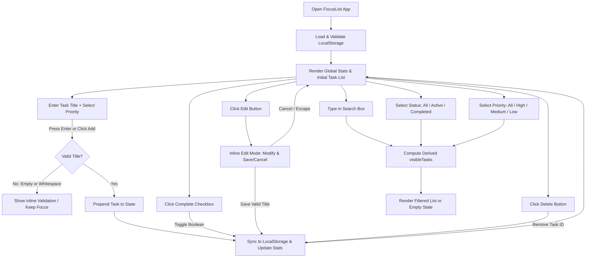

# Product Development Requirements (PDR)
## Project: FocusList — FAIE Frontend Challenge

---

## 1. Executive Summary

**FocusList** is a lightweight, responsive, accessible, frontend-only productivity web application designed to help users capture, prioritize, organize, filter, and track daily tasks.

Built specifically for the **1-hour Frontend Arena FAIE (Frontend Arena Interactive Evaluation) timed challenge**, FocusList prioritizes deterministic functional correctness, zero-latency state transitions, robust browser persistence via Local Storage, rigorous accessibility compliance (WCAG 2.1 AA semantics), and flawless responsiveness across desktop, tablet, and mobile viewports.

---

## 2. Challenge Context & Constraints

| Parameter | Specification |
| :--- | :--- |
| **Challenge Name** | FocusList Challenge (Frontend Arena / FAIE Practice Challenge) |
| **Platform** | Frontend Arena (`frontendarena.online`) / FAIE Evaluation System |
| **Time Limit** | **60 Minutes (1 Hour)** end-to-end (Plan → Build → Verify → Deploy → Submit) |
| **Architecture** | **Strictly Frontend-Only**. No backend server, no external DB, no cloud backend/API services (Static frontend hosting like Vercel/Netlify is allowed) |
| **Data Storage** | Browser `localStorage` only (Deterministic client-side persistent task storage) |
| **Deployment** | Mandatory live production URL (Vercel, Netlify, Cloudflare Pages, or GitHub Pages) |
| **Evaluation Scope** | Automated & manual FAIE checks: Functionality, UI/UX, A11y, Responsiveness, Performance, Code Quality |

---

## 3. Product Vision & Principles

### Vision
FocusList serves as a distraction-free, high-clarity daily task workspace. It eliminates visual noise in favor of instant discoverability, tactile keyboard and mouse interactions, clear status indicators, and reliable browser-based persistent task storage.

### Core Product Principles
1. **Zero State Desynchronization**: A single, immutable source of truth (`tasks`) drives all derived filters, search indices, and global metrics.
2. **Speed Over Decoration**: Instantaneous DOM updates without heavy animation locks, excessive glassmorphism, or nested modal traps.
3. **Target WCAG 2.1 AA-Aligned Accessibility**: Semantic HTML5 controls, explicit accessible names for icon buttons, keyboard-first traversal, and visible focus rings.
4. **Evaluation Safety**: Clean, predictable DOM hierarchies, deterministic element identifiers (`id` / `aria-label` / `data-testid`), and zero application-caused console errors.

---

## 4. Problem Statement

Modern to-do applications are frequently overloaded with heavy cloud dependencies, mandatory authentication, complex multi-step forms, and sluggish interfaces. Users seeking immediate task capture are slowed down by unnecessary friction.

FocusList solves this by providing a single-view, client-side task manager that captures inputs in seconds, allows instant triaging via priority flags (High, Medium, Low), enables compound searching and status filtering, and guarantees persistence across browser refreshes without requiring external infrastructure.

---

## 5. Goals & Non-Goals

### In-Scope Goals (Target Deliverables)
- [x] **Task Creation**: Instant input field with Enter-key submission and priority selection.
- [x] **Task Management (CRUD)**: Mark complete/active toggle, in-place title & priority editing, and deletion.
- [x] **Priority Categorization**: Tri-level priority assignment (High, Medium, Low) with clear text + visual indicators.
- [x] **Compound Search & Filtering**: Multi-condition live evaluation (`Search Query` + `Status Filter` + `Priority Filter`).
- [x] **Global Statistics**: Real-time counts for Total, Completed, and Pending tasks computed over the entire dataset.
- [x] **Reliable Local Persistence**: Automatic sync to `localStorage` with fail-safe initialization and corruption recovery.
- [x] **Fully Responsive Interface**: Mobile-first fluid layout with no horizontal overflow and 44px+ touch targets.
- [x] **WCAG 2.1 AA-Aligned Accessibility**: Semantic elements, ARIA labels for icon actions, keyboard navigable, high contrast.
- [x] **Live Web Deployment**: Verified production deployment URL on static frontend hosting.

### Explicit Non-Goals (Out of Scope / Prohibited)
- ❌ Backend APIs, Express/Node servers, or serverless API routes.
- ❌ External databases or cloud data storage (Firebase, Supabase, PostgreSQL, MongoDB, etc.).
- ❌ Artificial Intelligence (AI), Machine Learning (ML), LLMs, generative AI, chatbots, natural language task processing, or external intelligent service APIs (OpenAI, Gemini, Claude, Groq, Perplexity, Hugging Face, etc.).
- ❌ User authentication, login modals, OAuth, or multi-user accounts.
- ❌ Third-party telemetry, analytics trackers, or external CDN dependencies that could block offline loading.
- ❌ Complex external state management libraries (Redux, Zustand, MobX) — native framework state/hooks or vanilla JS is preferred to conserve challenge time.
- ❌ Unrequested features: subtasks, file attachments, recurring timers, calendar views, drag-and-drop ordering, tags/categories, push notifications.

---

## 6. Target User & Use Cases

- **Fast-Paced Knowledge Worker**: Needs to dump 5–10 urgent daily tasks, tag top-priority items, and tick them off sequentially.
- **Mobile Task Manager**: Accesses the live URL on a smartphone browser, needing clear tap targets, readable font sizes, and single-handed operation.
- **FAIE Automated Evaluator / Reviewer**: Programmatically and manually triggers task additions, edits, deletions, searches, filter toggles, and page reloads to verify functional compliance and layout integrity.

---

## 7. Core User Journeys



---

## 8. Functional Requirements Specification

### FR-1: Task Creation
- **FR-1.1**: The UI must display an intuitive task creation form with a text `<input>` and a priority `<select>` (or button group) and an "Add Task" `<button>`.
- **FR-1.2**: Submitting via clicking "Add Task" or pressing <kbd>Enter</kbd> inside the text input must validate the title.
- **FR-1.3**: Whitespace-only or empty strings must be rejected. The input must not clear, and invalid tasks must never enter the dataset.
- **FR-1.4**: On successful creation, the new task is added to the collection, the input field clears, focus returns to the input, and the task list updates immediately.
- **FR-1.5**: Newly created tasks default to `completed: false` and the selected priority (default: `Medium` if unselected).

### FR-2: Task Completion & Reopening
- **FR-2.1**: Each task row must provide an accessible checkbox/toggle button to mark completion.
- **FR-2.2**: Clicking the toggle flips `completed` between `true` and `false`.
- **FR-2.3**: Completed tasks must display distinct visual cues (e.g., subtle strikethrough on title, muted priority badge, diminished opacity/tint) without breaking text readability.
- **FR-2.4**: Completed tasks can be reopened (marked active) at any time.

### FR-3: Task Editing
- **FR-3.1**: Each task row must provide an "Edit" trigger (accessible button with label/tooltip).
- **FR-3.2**: Triggering edit mode swaps the static title into an inline edit `<input>` pre-populated with the current title.
- **FR-3.3**: Users can save via a "Save" button or pressing <kbd>Enter</kbd>.
- **FR-3.4**: Users can cancel via a "Cancel" button or pressing <kbd>Escape</kbd>, reverting the title to its prior value.
- **FR-3.5**: Saving an empty or whitespace-only title is prohibited (either retains existing title or displays clear inline error).
- **FR-3.6**: Editing allows modifying the task title (and optionally priority if implemented simply) while preserving the task's original `id`, `createdAt`, and `completed` state. If time-constrained, title editing is the mandatory baseline.

### FR-4: Task Deletion
- **FR-4.1**: Each task row must feature a "Delete" button with accessible labeling (`aria-label="Delete task: [Title]"`).
- **FR-4.2**: Clicking delete immediately removes the task from the dataset.
- **FR-4.3**: Deletion updates the global task collection, recalculates statistics, updates the active search/filtered view, and immediately syncs with `localStorage`.

### FR-5: Task Priority Management
- **FR-5.1**: Every task must possess exactly one priority value: `HIGH`, `MEDIUM`, or `LOW`.
- **FR-5.2**: Priority must be assigned during creation and visually rendered on each task card/row via clear text badges ("High", "Medium", "Low") paired with distinct visual accents (e.g., border color or badge tint) to ensure non-colorblind readability.
- **FR-5.3**: Priority values must be strictly persisted in `localStorage`.

### FR-6: Search Functionality
- **FR-6.1**: A search input field must filter tasks live by matching against the task `title`.
- **FR-6.2**: Matching must be **case-insensitive** and ignore leading/trailing search whitespace (`title.toLowerCase().includes(query.trim().toLowerCase())`).
- **FR-6.3**: Clearing the search input immediately restores the unfiltered list (subject to active status/priority filters).

### FR-7: Status & Priority Filtering
- **FR-7.1**: Status filter must support three options:
  - `ALL`: Display all tasks.
  - `ACTIVE`: Display only incomplete tasks (`completed === false`).
  - `COMPLETED`: Display only completed tasks (`completed === true`).
- **FR-7.2**: Priority filter must support four options:
  - `ALL`: Display all priority levels.
  - `HIGH`: Display only High priority tasks.
  - `MEDIUM`: Display only Medium priority tasks.
  - `LOW`: Display only Low priority tasks.
- **FR-7.3**: **Compound Filtering**: Search, status filter, and priority filter must operate simultaneously using an `AND` conjunction:
  $$\text{visibleTasks} = \text{tasks} \cap \text{SearchMatch} \cap \text{StatusMatch} \cap \text{PriorityMatch}$$

### FR-8: Global Task Statistics
- **FR-8.1**: The application must display three live metric counters:
  - **Total Tasks**: Count of all stored tasks (`tasks.length`).
  - **Completed Tasks**: Count of tasks with `completed === true`.
  - **Pending Tasks**: Count of tasks with `completed === false`.
- **FR-8.2**: Statistics must be computed across the **entire dataset** and must **not** change when the user applies search or view filters.
- **FR-8.3**: Statistics must recalculate instantly on every create, toggle, edit, or delete action.

### FR-9: Local Storage Persistence
- **FR-9.1**: Tasks must be serialized to `localStorage` under the dedicated key `focuslist_tasks_v1`.
- **FR-9.2**: On initial load, the app parses `localStorage`. If data is missing, empty, or corrupted, it falls back gracefully to an empty array (or sensible demo seed) without throwing unhandled exceptions.
- **FR-9.3**: Every state mutation triggers synchronous or batch persistence.

---

## 9. Task Data Model & Schema

### Data Structure Specification

```typescript
export type PriorityLevel = 'HIGH' | 'MEDIUM' | 'LOW';

export interface Task {
  /** Unique stable identifier (e.g., crypto.randomUUID() or Date.now().toString() + random suffix) */
  id: string;
  
  /** Normalized, non-empty task description */
  title: string;
  
  /** Task completion state */
  completed: boolean;
  
  /** Strict priority enumeration */
  priority: PriorityLevel;
  
  /** ISO 8601 creation timestamp string (e.g. "2026-09-19T12:00:00.000Z") */
  createdAt: string;
  
  /** ISO 8601 update timestamp string */
  updatedAt: string;
}
```

### Validation Invariants
1. `id`: Non-empty string, immutable across edits.
2. `title`: `typeof title === 'string' && title.trim().length > 0`.
3. `completed`: Strict boolean (`true` | `false`).
4. `priority`: Must match `['HIGH', 'MEDIUM', 'LOW'].includes(priority)`. If invalid during deserialization, fallback to `'MEDIUM'`.
5. `createdAt` / `updatedAt`: Valid ISO strings or numeric millisecond timestamps.

---

## 10. State Management & Single Source of Truth

To eliminate state desynchronization bugs, FocusList employs a **Unidirectional Data Flow** architecture:

```text
┌────────────────────────────────────────────────────────┐
│                   PRIMARY STATE                        │
│             tasks: Task[] (in Memory)                  │
└───────────────────────────┬────────────────────────────┘
                            │
               ┌────────────┴────────────┐
               ▼                         ▼
   ┌───────────────────────┐ ┌───────────────────────┐
   │    DERIVED METRICS    │ │   FILTER CRITERIA     │
   │ total = tasks.length  │ │ searchQuery: string   │
   │ completed = tasks...  │ │ statusFilter: string  │
   │ pending = tasks...    │ │ priorityFilter: string│
   └───────────────────────┘ └───────────┬───────────┘
                                         ▼
                             ┌───────────────────────┐
                             │ DERIVED VISIBLE TASKS │
                             │ visibleTasks = f(...) │
                             └───────────────────────┘
```

### State Transformation Rules:
1. **Never mutate `tasks` directly**: Always produce a new array reference on modifications.
2. **Derived variables are never stored in state**: `totalCount`, `completedCount`, `pendingCount`, and `visibleTasks` are pure computed expressions calculated on every render.

---

## 11. Search and Filtering Logic Matrix

Let $T$ be the complete array of tasks. The rendered task list $V$ is defined deterministically:

$$V = \{ t \in T \mid \text{MatchSearch}(t) \land \text{MatchStatus}(t) \land \text{MatchPriority}(t) \}$$

Where:
- $\text{MatchSearch}(t) = (\text{searchQuery} = \text{""}) \lor t.\text{title}.\text{toLowerCase}().\text{includes}(\text{searchQuery}.\text{trim}().\text{toLowerCase}())$
- $\text{MatchStatus}(t) = (\text{statusFilter} = \text{"ALL"}) \lor (\text{statusFilter} = \text{"ACTIVE"} \land \neg t.\text{completed}) \lor (\text{statusFilter} = \text{"COMPLETED"} \land t.\text{completed})$
- $\text{MatchPriority}(t) = (\text{priorityFilter} = \text{"ALL"}) \lor (t.\text{priority} = \text{priorityFilter})$

### Filter Combination Test Matrix

| Case | Search Query | Status Filter | Priority Filter | Expected Output |
| :--- | :--- | :--- | :--- | :--- |
| **C1** | `""` (empty) | `ALL` | `ALL` | All tasks in dataset |
| **C2** | `""` (empty) | `ACTIVE` | `ALL` | All uncompleted tasks |
| **C3** | `""` (empty) | `COMPLETED` | `ALL` | All completed tasks |
| **C4** | `""` (empty) | `ALL` | `HIGH` | All tasks with High priority |
| **C5** | `"design"` | `ACTIVE` | `HIGH` | Incomplete High-priority tasks containing "design" (case-insensitive) |
| **C6** | `"deploy"` | `COMPLETED` | `LOW` | Completed Low-priority tasks containing "deploy" |
| **C7** | `"xyznotfound"`| `ALL` | `ALL` | Empty array $\rightarrow$ Triggers "No Matching Tasks" empty state |

---

## 12. Statistics Logic

```typescript
const totalTasks: number = tasks.length;
const completedTasks: number = tasks.filter(t => t.completed).length;
const pendingTasks: number = tasks.filter(t => !t.completed).length;
```

**Critical Invariant**: Even if `visibleTasks.length === 0` due to restrictive filters, `totalTasks`, `completedTasks`, and `pendingTasks` must display the global numbers of the underlying dataset.

---

## 13. Data Persistence & Local Storage Strategy

### Storage Key
`focuslist_tasks_v1`

### Lifecycle Handlers
1. **Bootstrap / Hydration**:
   ```typescript
   function loadTasksFromStorage(): Task[] {
     try {
       const raw = localStorage.getItem('focuslist_tasks_v1');
       if (!raw) return [];
       const parsed = JSON.parse(raw);
       if (!Array.isArray(parsed)) return [];
       return parsed.filter(item => 
         item && 
         typeof item.id === 'string' && 
         typeof item.title === 'string' && 
         typeof item.completed === 'boolean' &&
         ['HIGH', 'MEDIUM', 'LOW'].includes(item.priority)
       );
     } catch (e) {
       console.error("Failed to load tasks from localStorage:", e);
       return [];
     }
   }
   ```
2. **Mutation Sync**:
   ```typescript
   function persistTasks(tasks: Task[]): void {
     try {
       localStorage.setItem('focuslist_tasks_v1', JSON.stringify(tasks));
     } catch (e) {
       console.error("Failed to persist tasks to localStorage:", e);
     }
   }
   ```
3. **Storage Quota / Disabled Edge Case**: Wrap all storage operations in `try/catch` blocks so private browsing modes or restricted iframes do not throw unhandled exceptions.

---

## 14. UI/UX Requirements & Design System

FocusList features an inviting, warm, calm editorial productivity aesthetic. Built around warm paper foundations, a signature sunset coral accent, and soft supporting mint/lavender/amber tones, it balances friendly visual warmth with high contrast and structured typography.

### Active Color Palette Tokens

```text
Canvas:
#fbf7f2

Canvas subtle:
#f4ece2

Surface:
#ffffff

Subtle structural border:
#ebdcd0

Primary text:
#2d2621

Secondary text:
#6e6259

Primary accent:
#e0533c

Mint:
#3d9970

Lavender:
#8b6baf

Amber:
#d97706
```

### Typography Scale
- **Font Stack**: `-apple-system, BlinkMacSystemFont, "Segoe UI", Roboto, "Helvetica Neue", Arial, sans-serif`
- **Monospace Stack**: `ui-monospace, SFMono-Regular, "JetBrains Mono", Menlo, Monaco, Consolas, monospace`
- **H1 / Product title**: 24–28px, 600 weight
- **Section headings**: 18px, 500–600 weight
- **Task title**: 15–16px, 400–500 weight
- **Supporting metadata**: 12–13px, 400–500 weight
- **Metrics**: 20–24px, 600–700 weight
- **Small labels**: 11–12px, 500 weight

### Future Visual Direction: Hand-Drawn Doodle Language Guidelines
When future visual polish passes occur, small hand-drawn doodles may be introduced to add warmth and memorability without distracting from core task management:
1. **Visual Style**: Hand-drawn, lightweight, slightly imperfect, friendly, cohesive with the warm palette (e.g. tiny stars, paper airplane, pencil, notebook, coffee cup, sun, paperclip, small plant, simple clock).
2. **Strict Restraint (90/10 Ratio)**: Target $\approx 90\%$ focused productivity UI, $10\%$ personality. Doodles must never interfere with task titles, inputs, search, filters, buttons, statistics, or mobile layouts.
3. **Strategic Placement**: Limit to header background, empty states, or subtle background corners.
4. **Performance & A11y**: Use lightweight inline SVG or CSS shapes with `pointer-events: none` and `aria-hidden="true"`. Respect `@media (prefers-reduced-motion: reduce)`.
5. **Devil's Advocate Evaluation Rule**: Reject any decorative element that harms performance, accessibility, clarity, or the 1-hour challenge scope.

---

## 15. Information Architecture & Layout Structure

```text
┌──────────────────────────────────────────────────────────────┐
│  HEADER: FocusList Branding + Subtitle                       │
├──────────────────────────────────────────────────────────────┤
│  STATISTICS BAR: [ Total: 8 ] [ Completed: 5 ] [ Pending: 3 ]│
├──────────────────────────────────────────────────────────────┤
│  CREATE TASK BAR:                                            │
│  [ Task Title Input.................. ] [Priority: High ▾] [ + Add Task ] │
├──────────────────────────────────────────────────────────────┤
│  SEARCH & FILTERS BAR:                                       │
│  [ 🔍 Search tasks...       ] [ All | Active | Completed ] [ Priority: All ▾ ]│
├──────────────────────────────────────────────────────────────┤
│  TASK LIST / EMPTY STATE CONTAINER                           │
│  ┌────────────────────────────────────────────────────────┐  │
│  │ [✓] Deploy client build       [HIGH]   [Edit] [Delete] │  │
│  ├────────────────────────────────────────────────────────┤  │
│  │ [ ] Review pull requests      [MED]    [Edit] [Delete] │  │
│  ├────────────────────────────────────────────────────────┤  │
│  │ [ ] Update documentation      [LOW]    [Edit] [Delete] │  │
│  └────────────────────────────────────────────────────────┘  │
└──────────────────────────────────────────────────────────────┘
```

---

## 16. Responsive Design Strategy

| Breakpoint | Target Devices | Layout Adaptations |
| :--- | :--- | :--- |
| **Desktop** ($\ge 1024\text{px}$) | Laptops, Large Monitors | Max container width `768px` or `840px` centered; 3-column stats card row; horizontal inline task creation; single-line search & filter bar. |
| **Tablet** ($768\text{px} - 1023\text{px}$) | iPads, Tablets | Fluid padding (`1.5rem`); stats grid adjusts to 3 columns; filter buttons wrap neatly; touch target sizes $\ge 44\text{px} \times 44\text{px}$. |
| **Mobile** ($< 768\text{px}$) | Smartphones (320px–480px) | Full-width container with `1rem` margin; stats in 3-column compact cards; task creation form stacks vertically (Input $\rightarrow$ Priority Select $\rightarrow$ Add Button); search bar is full-width; status filter buttons occupy full-width segmented tab row; task action buttons remain visible and easily tappable. **Zero horizontal scrollbar**. |

---

## 17. Accessibility (A11y) Strategy (Target WCAG 2.1 AA-Aligned)

The implementation targets accessibility practices aligned with applicable WCAG 2.1 AA requirements, emphasizing semantic structure, keyboard operability, explicit labels, and visible focus:

1. **Semantic HTML5 Structure**: Use `<header>`, `<main>`, `<section>`, `<form>`, `<input>`, `<button>`, `<label>`, `<fieldset>`, and `<legend>` appropriately.
2. **Accessible Form Controls**:
   - Every input has a linked `<label>` or explicit `aria-label`.
   - Creation input: `aria-label="New task title"`.
   - Priority selector: `aria-label="Select task priority"`.
   - Search input: `aria-label="Search tasks by title"`.
3. **Accessible Icon & Action Buttons**:
   - Edit button: `aria-label="Edit task: [Task Title]"`
   - Delete button: `aria-label="Delete task: [Task Title]"`
   - Complete toggle: `<input type="checkbox" aria-label="Mark task as complete: [Task Title]">`
4. **Color Independence**: Priority levels are identified with explicit textual labels ("High", "Medium", "Low") alongside color indicators.
5. **Keyboard Navigation & Visible Focus**:
   - Full keyboard operability (<kbd>Tab</kbd>, <kbd>Shift+Tab</kbd>, <kbd>Space</kbd>, <kbd>Enter</kbd>, <kbd>Escape</kbd>).
   - High-contrast `:focus-visible` outline (`2px solid var(--border-focus)` with `2px` offset).
6. **ARIA Live Regions**: Statistics and dynamic search result counts communicate updates cleanly without screen-reader chatter.

---

## 18. Performance & Technical Optimization

- **Zero Heavy External Libraries**: Native DOM and vanilla ES6+ runtime; zero heavy UI kit dependencies (e.g., Material-UI, Ant Design).
- **Fast, Immediate Interactions**: Lightweight static implementation designed to minimize First Contentful Paint (FCP) and eliminate layout shift risk.
- **Efficient Updates**: Unidirectional state notifications with derived computation over in-memory arrays.
- **Lightweight Asset Footprint**: SVG icons used inline; no blocking external font or image assets.

---

## 19. Code Quality & Architectural Structure

FocusList follows a strict single-source architecture:

```text
TypeScript Source (src/)
  ├── types/task.ts           # Strict Task, PriorityLevel, FilterStatus definitions
  ├── utils/storage.ts        # Safe localStorage get/set with JSON schema validation
  ├── services/state.ts       # Typed state coordinator, derived metrics & reordering
  └── main.ts                 # Typed DOM event binding & accessibility coordinator
        │
        ▼ (npm run build: tsc --noEmit && esbuild bundle)
Browser Runtime
  └── js/app.js               # Self-contained zero-CORS browser executable bundle
```

### Build & Tooling Pipeline
- **Authoritative Source**: `src/**/*.ts` (100% strict TypeScript, 0 `any`).
- **Compilation/Bundling**: Lightweight `esbuild` bundling to `js/app.js` (IIFE format).
- **Typechecking**: `npm run typecheck` (`tsc --noEmit`).
- **Linting**: `npm run lint` (`eslint src/ js/app.js --ext .ts,.js`).

---

## 20. Edge Cases & Handling Matrix

| Edge Case ID | Scenario | Expected Behavior |
| :--- | :--- | :--- |
| **EC-01** | User submits empty string or spaces `"   "` in creation input | Reject submission. Do not create task. Retain focus. |
| **EC-02** | User enters very long task title ($>150$ characters) | CSS `word-break: break-word` prevents layout breaking or horizontal scroll. |
| **EC-03** | User submits duplicate task title | Allowed (tasks have unique IDs; names may repeat). |
| **EC-04** | User edits task title to empty or whitespace and hits save | Disallow save or revert to previous title; prevent empty task in state. |
| **EC-05** | User presses <kbd>Escape</kbd> during inline edit | Cancel edit mode immediately without saving changes. |
| **EC-06** | User deletes the last remaining task | Task list transitions cleanly to initial empty state ("Your list is clear"). |
| **EC-07** | Search query matches no tasks | Display "No matching tasks found" with clear filter hint. |
| **EC-08** | Browser page is refreshed after any CRUD action | Exact state is restored from `localStorage`. |
| **EC-09** | `localStorage` data contains malformed JSON or corrupted schema | Error caught gracefully in `try/catch`; state falls back to `[]` without crashing. |
| **EC-10** | Rapid repeated clicks on "Add" or "Delete" | Deterministic state updates without race conditions or orphaned state. |
| **EC-11** | Special characters in task title (`<script>`, `&`, `""`) | Rendered strictly as text content (no `innerHTML` XSS vulnerability). |

---

## 21. Empty States & Feedback States

FocusList explicitly distinguishes between two contextual empty states:

1. **Initial Zero-Data State (Global empty)**:
   - *Headline*: "Your list is clear"
   - *Subtext*: "Nothing needs your attention right now. Add a task above whenever you are ready."
   - *Visual*: Warm sun/focus badge icon.
2. **Filtered No-Results State (Filter/Search empty)**:
   - *Headline*: "No matching tasks found"
   - *Subtext*: "Try adjusting or resetting your search query and filters."
   - *Action*: "Reset all filters" button to reset search and filter controls to default.

---

## 22. Error Handling & Safety

- **XSS Prevention**: DOM text content rendering prevents HTML injection from user inputs.
- **Storage Availability Fallback**: In-memory state acts as an automatic fallback if `localStorage` throws a quota or permission error.
- **Console Cleanliness**: No application-caused runtime errors, React warnings, hydration warnings, broken imports, or obvious application-generated console problems under normal execution.

---

## 23. Deployment Strategy & Live Verification

- **Target Host**: Vercel / Netlify / Cloudflare Pages / GitHub Pages (Static frontend hosting).
- **Build Output**: Static Single Page Application bundle.
- **Post-Deploy Smoke Test Checklist**:
  - [ ] HTTPS URL loads cleanly.
  - [ ] Add 3 tasks with High, Medium, and Low priorities.
  - [ ] Complete 1 task, edit 1 task, delete 1 task.
  - [ ] Verify search by title.
  - [ ] Filter by Status (Active / Completed).
  - [ ] Filter by Priority (High / Med / Low).
  - [ ] Verify Total, Completed, Pending counters.
  - [ ] Refresh the page and confirm task persistence.
  - [ ] Check DevTools console for zero application-caused errors.
  - [ ] Verify layout on simulated mobile viewport (iPhone 12 / Pixel 5).

---

## 24. FAIE Evaluation Considerations & Mapping

| Evaluation Dimension | FAIE Check Focus | FocusList Implementation Alignment |
| :--- | :--- | :--- |
| **Functionality** | CRUD, Priorities, Search, Filter, Stats, Persistence | Designed and validated for complete deterministic logic and Local Storage sync. |
| **UI/UX & Hierarchy** | Clear layout, visual distinctions, interactive feedback | Warm cream & coral palette, distinct badge accents, tactile hover/active states. |
| **Responsiveness** | Mobile, tablet, desktop viewports without overflow | Fluid CSS Grid & Flexbox layout; touch-friendly $\ge 44\text{px}$ targets. |
| **Accessibility (A11y)**| Screen-reader compatibility, keyboard navigation, contrast | Semantic HTML5, explicit `aria-label`s, visible focus rings, high contrast. |
| **Performance** | Load time, instant DOM reactivity, small bundle | Lightweight bundle, zero unnecessary libraries, $O(N)$ derived operations. |
| **Code Quality** | Modular components, clean naming, no dead code | Single authoritative TypeScript source, strict typing, clean separation of concerns. |

---

## 25. Requirement Priority Matrix

```text
┌────────────────────────────────────────────────────────────────────────┐
│ P0: MANDATORY (Must work flawlessly for evaluation pass)               │
│ - Task Creation (Validation, Enter key)                                │
│ - Task Completion & Reopening                                          │
│ - Task In-Place Editing (Save/Cancel)                                  │
│ - Task Deletion                                                        │
│ - Priority Assignment (High, Medium, Low)                              │
│ - Search by Title (Case-insensitive)                                   │
│ - Status Filtering (All / Active / Completed)                          │
│ - Priority Filtering (All / High / Medium / Low)                       │
│ - Global Task Statistics (Total, Completed, Pending)                   │
│ - Local Storage Persistence across reload                              │
│ - Responsive Layout (Desktop + Mobile)                                 │
│ - Working Live Deployment URL                                          │
├────────────────────────────────────────────────────────────────────────┤
│ P1: STRONGLY RECOMMENDED (High evaluation score)                       │
│ - Target WCAG 2.1 AA-aligned accessibility (aria-labels, focus rings)   │
│ - Context-aware Empty States (Global vs Filtered)                      │
│ - Clear Filters action button                                          │
│ - Robust error handling for localStorage                               │
│ - Polished, modern visual hierarchy                                   │
│ - In-place priority modification during task edit                      │
├────────────────────────────────────────────────────────────────────────┤
│ P2: OPTIONAL ENHANCEMENTS (Only if time permits)                       │
│ - Subtle micro-transitions (CSS opacity/transform)                    │
│ - Quick status toggle keyboard shortcut                                │
└────────────────────────────────────────────────────────────────────────┘
```

---

## 26. Acceptance Criteria (Given-When-Then)

### AC-1: Task Creation
- **Given** the user is on the FocusList page,
- **When** the user types `"Prepare slides"` and selects `"High"` priority and presses <kbd>Enter</kbd>,
- **Then** a new task appears at the top of the list with title `"Prepare slides"`, priority badge `"High"`, status `"Active"`, the input field is cleared, and Total & Pending counters increment by 1.

### AC-2: Whitespace Rejection
- **Given** the user enters `"   "` into the task input,
- **When** the user clicks "Add Task",
- **Then** no task is created, the input retains focus, and statistics remain unchanged.

### AC-3: Task Completion Toggle
- **Given** an active task `"Submit report"`,
- **When** the user clicks the task's completion checkbox,
- **Then** the task title displays completed styling, the Completed count increments by 1, and the Pending count decrements by 1.

### AC-4: In-Place Editing
- **Given** an existing task `"Draft email"`,
- **When** the user clicks the "Edit" button, types `"Draft client email"`, and presses <kbd>Enter</kbd>,
- **Then** the task title updates to `"Draft client email"`, edit mode closes, and the change persists in `localStorage`.

### AC-5: Task Deletion
- **Given** a task in the list,
- **When** the user clicks the "Delete" button,
- **Then** the task is removed immediately from the DOM and state, and the Total/Completed/Pending stats update accordingly.

### AC-6: Compound Search and Filter
- **Given** 4 tasks: (1) Active High `"Build API"`, (2) Active Med `"Build UI"`, (3) Completed High `"Build Specs"`, (4) Active Low `"Write docs"`,
- **When** the user searches `"Build"`, selects Status `"Active"`, and selects Priority `"High"`,
- **Then** only task (1) `"Build API"` is rendered in the visible task list, while the global statistics still reflect Total: 4.

### AC-7: Persistence Across Refresh
- **Given** several tasks have been created, edited, and toggled,
- **When** the browser window is reloaded,
- **Then** all tasks and their exact completion and priority states are restored identically from `localStorage`.

---

## 27. Comprehensive Manual Acceptance Test Plan

| Test ID | Area | Action / Input | Expected Result | Pass/Fail |
| :--- | :--- | :--- | :--- | :--- |
| **TC-01** | Create | Type `"Complete FAIE Demo"`, select `High`, click "Add" | Task appears in list, `High` badge shown, Total=1, Pending=1 | [ ] |
| **TC-02** | Validation | Type `""` and click "Add"; type `"   "` and hit Enter | No task created; no error in console | [ ] |
| **TC-03** | Priority | Create tasks with `Medium` and `Low` priority | Badges render with correct text and color accent | [ ] |
| **TC-04** | Complete | Click checkbox on active task | Checkbox is checked; title strikethrough; Completed stat increases | [ ] |
| **TC-05** | Reopen | Click checkbox on completed task | Checkbox unchecks; title normal; Pending stat increases | [ ] |
| **TC-06** | Edit Save | Click Edit on a task $\rightarrow$ change text $\rightarrow$ click Save / hit Enter | New title displayed; edit mode exits | [ ] |
| **TC-07** | Edit Cancel | Click Edit on a task $\rightarrow$ change text $\rightarrow$ hit Escape / click Cancel | Title reverts to original; edit mode exits | [ ] |
| **TC-08** | Delete | Click Delete on a task | Task removed from list; Total/Pending counters decrease | [ ] |
| **TC-09** | Search | Type substring (e.g. `"faie"`) in search input | Only matching tasks shown; non-matching hidden | [ ] |
| **TC-10** | Status Filter | Click `Active` tab, then `Completed` tab | Only incomplete tasks shown under `Active`; only completed under `Completed` | [ ] |
| **TC-11** | Priority Filter| Select `High` priority dropdown | Only `High` priority tasks displayed | [ ] |
| **TC-12** | Combined Filter| Search query + `Active` status + `High` priority | Only tasks meeting ALL 3 criteria are displayed | [ ] |
| **TC-13** | Empty State 1 | Delete all tasks | "No tasks yet" message and prompt displayed | [ ] |
| **TC-14** | Empty State 2 | Filter with non-matching search term | "No matching tasks found" message displayed | [ ] |
| **TC-15** | Persistence | Add tasks $\rightarrow$ refresh browser page | All tasks restored from `localStorage` with exact status | [ ] |
| **TC-16** | Responsive | Resize browser to $375\text{px}$ width | No horizontal overflow; all buttons visible and tappable | [ ] |
| **TC-17** | Keyboard | Navigate via <kbd>Tab</kbd>, check boxes with <kbd>Space</kbd> | All interactive elements operable via keyboard alone | [ ] |
| **TC-18** | A11y / Console | Inspect with Chrome DevTools | Zero application-caused errors or warnings; icon buttons have `aria-label`s | [ ] |

---

## 28. 1-Hour Execution Schedule & Milestone Breakdown

```text
┌──────────────┬──────────────────────────────────────────────┬──────────────┐
│ Time Window  │ Milestone Focus                              │ Deliverable  │
├──────────────┼──────────────────────────────────────────────┼──────────────┤
│ 00:00–05:00  │ Workspace verification & Project Bootstrap   │ Vanilla TS+DOM│
│ 05:00–20:00  │ Core Task State & Full CRUD Implementation   │ Create/Toggle│
│              │ (Create, Toggle Complete, In-place Edit, Del)│ Edit/Delete  │
│ 20:00–32:00  │ Priority, Compound Search, Filters & Stats   │ Filters+Stats│
│              │ + Robust LocalStorage Sync                   │ & Persistence│
│ 32:00–44:00  │ Modern UI/UX, Design Tokens & Responsiveness │ Mobile+Tablet│
│              │ (Empty states, badges, card layouts)         │ Polished UI  │
│ 44:00–50:00  │ Accessibility (A11y), Keyboard & Edge Cases  │ A11y Aligned │
│ 50:00–56:00  │ Production Build & Live Deployment           │ Live URL     │
│ 56:00–60:00  │ End-to-End Test Plan Execution on Live URL   │ Final Submit │
└──────────────┴──────────────────────────────────────────────┴──────────────┘
```

---

## 29. Final Pre-Submission Verification Checklist

- [ ] All 12 P0 requirements verified working.
- [ ] No horizontal scrolling on mobile viewports ($320\text{px}$ – $414\text{px}$).
- [ ] Global statistics remain accurate during active searches and filtering.
- [ ] Local storage persistence verified across hard reload (<kbd>Ctrl+F5</kbd> / <kbd>Cmd+Shift+R</kbd>).
- [ ] Accessible names present on all icon buttons (`aria-label`).
- [ ] Production build passes with zero errors and warnings.
- [ ] Live URL is reachable, responsive, and functional on a separate clean browser session.

---

## 30. Deferred Features / Out-of-Scope Guardrails

The following items are intentionally excluded to protect the strict 1-hour timebox:
- ⛔ AI, ML, LLMs, Chatbots, or Intelligent APIs (OpenAI, Claude, Gemini, Groq, etc.).
- ⛔ Categorization folders / project tags.
- ⛔ Drag-and-drop task reordering.
- ⛔ Cloud sync / backend databases / serverless API endpoints.
- ⛔ User accounts / authentication.
- ⛔ Audio alarms / reminder push notifications.
